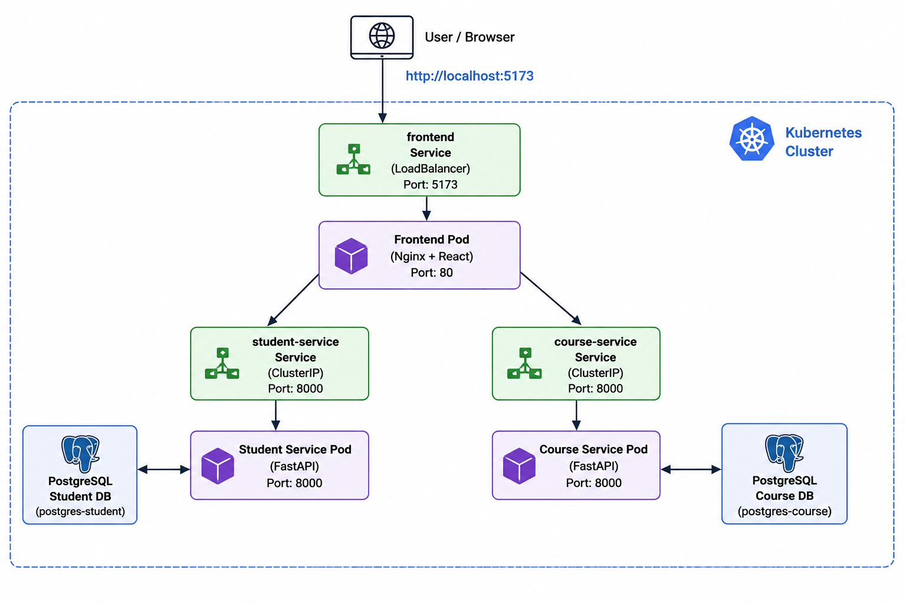

# Week 04 Example 2 – Running the Application with Local Kubernetes (Docker Desktop)

## Overview

In this example, you will deploy the Campus Course Registration System to a local Kubernetes cluster using Docker Desktop. The application consists of three components:

* **Student Service** (FastAPI + PostgreSQL)
* **Course Service** (FastAPI + PostgreSQL)
* **React Frontend**

The backend services communicate with their own PostgreSQL databases, while the frontend communicates with the backend services through internal Kubernetes networking.


---

# Prerequisites

Before starting, ensure the following software is installed:

* Python 3.12
* Node.js (for frontend development if required)
* Docker Desktop
* Kubernetes enabled in Docker Desktop
* kubectl


```bash
kubectl version --client
```
---

Enable Kubernetes in Docker Desktop:

1. Open **Docker Desktop**
2. Go to **Settings**
3. Select **Kubernetes**
4. Tick **Enable Kubernetes**
5. Click **Apply & Restart**

---

# Step 1 – Clone the Repository

```bash
git clone https://github.com/sit722-devops/week04.git
```

```bash
cd example-2
```

---

# Step 2 – Setup and Testing
Before using Docker or Kubernetes, run the unit tests for both backend services.

### Student Service

1. Navigate to the Student Service.

    ```bash
    cd student-service
    ```

2. Create a virtual environment.

    ```bash
    # Create the virtual environment
    python -m venv .venv

    # Activate the virtual environment
    # On macOS/Linux:
    source ./.venv/bin/activate

    # On Windows (Command Prompt):
    # .\.venv\Scripts\activate.bat

    # On Windows (PowerShell):
    # .\.venv\Scripts\Activate.ps1
    ```

3. Install dependencies:

    ```bash
    pip install -r requirements.txt
    ```
4. Run Unit Tests

    ```bash
    pytest --verbose tests
    ```

5. Deactivate the virtual environment and return to the project root.

    ```bash
    deactivate
    cd ..
    ```

> **NOTE**:
> Repeat the same steps for the Course Service.
> Ensure all tests pass before continuing.


## Frontend

1. Navigate to the frontend.

    ```bash
    cd frontend
    ```

2. Install the required Node.js packages.

    ```bash
    npm install
    ```

3. Run Tests
    ```bash
    npm test
    ```

4. Return to the project root.

    ```bash
    cd ..
    ```
---

# Step 4 – Run the Application with Docker Compose

Before deploying to Kubernetes, verify that the application works correctly using Docker Compose.

From the project root:

    ```bash
    docker compose build --no-cache

    docker compose up -d
    ```

## Verify Running Containers

Run following:

```bash
docker compose ps
```

You should see the following containers running:

* frontend
* student-service
* course-service
* student-db
* course-db

---

## Access the Application

### Frontend

```
http://localhost:5173
```

Verify that:

* Student records load successfully.
* Course records load successfully.
* Create, Update and Delete operations work correctly.

## Stop the Application

Stop all running containers.

```bash
docker compose down
```

To also remove the PostgreSQL volumes and start with a fresh database next time, run:

```bash
docker compose down -v
```

---

# Step 5 – Build Docker Images

Build the Student Service image:

```bash
cd student-service

docker build -t student-service:v1 .
```

Build the Course Service image:

```bash
cd ../course-service

docker build -t course-service:v1 .
```

Build the Frontend image:

```bash
cd ../frontend

docker build -t frontend:v1 .
```

Verify the images:

```bash
docker images
```

---

# Step 6 – Deploy PostgreSQL

Deploy the Student PostgreSQL database:

```bash
kubectl apply -f kubernetes/postgres-student.yaml
```

Deploy the Course PostgreSQL database:

```bash
kubectl apply -f kubernetes/postgres-course.yaml
```

Verify:

```bash
kubectl get pods
```

Wait until both PostgreSQL pods show:

```
Running
```

---

# Step 7 – Deploy Backend Services

Deploy the Student Service:

```bash
kubectl apply -f kubernetes/student-service.yaml
```

Deploy the Course Service:

```bash
kubectl apply -f kubernetes/course-service.yaml
```

Verify:

```bash
kubectl get pods
```

---

# Step 8 – Deploy the Frontend

Deploy the React frontend:

```bash
kubectl apply -f kubernetes/frontend.yaml
```

Verify:

```bash
kubectl get pods
```

Verify the services:

```bash
kubectl get services
```

---

# Step 9 – Access the Application

Open the frontend:

```
http://localhost:5173
```

The frontend communicates with the backend services through Kubernetes internal networking.

---

# Step 10 – Verify the Deployment

List all pods:

```bash
kubectl get pods
```

List all services:

```bash
kubectl get services
```

Expected services include:

* frontend
* student-service
* course-service
* postgres-student
* postgres-course

---

# Step 11 – View Logs

Student Service

```bash
kubectl logs deployment/student-service
```

Course Service

```bash
kubectl logs deployment/course-service
```

Frontend

```bash
kubectl logs deployment/frontend
```

---

# Step 12 – Troubleshooting

Check pod status:

```bash
kubectl get pods
```

Describe a pod:

```bash
kubectl describe pod <pod-name>
```

View logs:

```bash
kubectl logs <pod-name>
```

Restart a deployment:

```bash
kubectl rollout restart deployment frontend
```

Restart the Student Service:

```bash
kubectl rollout restart deployment student-service
```

Restart the Course Service:

```bash
kubectl rollout restart deployment course-service
```

Delete all resources:

```bash
kubectl delete -f kubernetes/
```

---

# Kubernetes Architecture

```
                     Browser
                         │
              http://localhost:5173
                         │
                  Frontend Service
                         │
                  Frontend Pod (Nginx)
                         │
          ┌──────────────┴──────────────┐
          │                             │
   Student Service               Course Service
          │                             │
     Student Pod                   Course Pod
          │                             │
   PostgreSQL Service           PostgreSQL Service
          │                             │
   Student Database             Course Database
```

---

# Learning Outcomes

After completing this example, you should be able to:

* Deploy a multi-container application to Kubernetes.
* Build and use Docker images locally.
* Deploy Kubernetes Deployments and Services.
* Configure internal service-to-service communication.
* Verify Kubernetes deployments.
* Debug Kubernetes applications using logs and pod information.
* Manage application lifecycle using kubectl.
